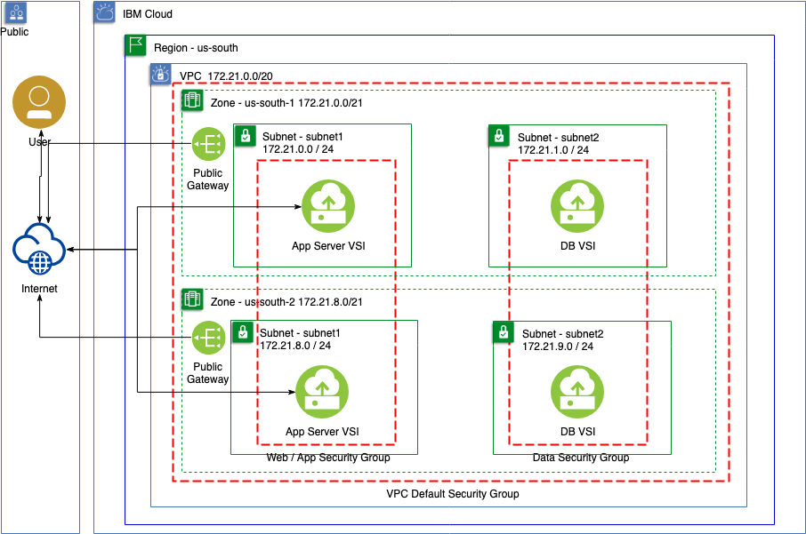
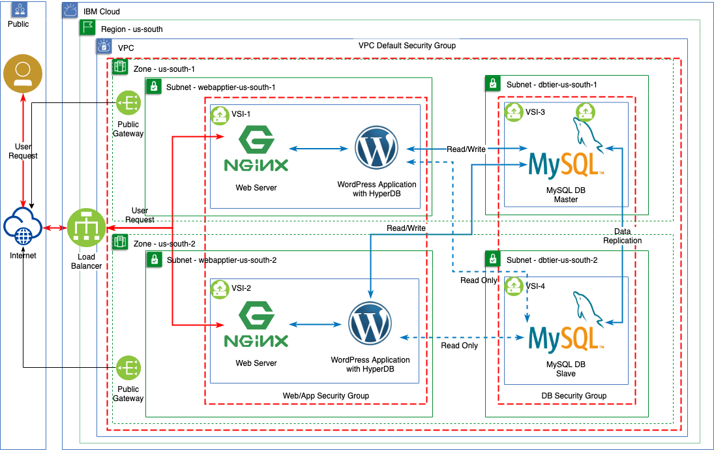

# Deploying the VPC Infrastructure using IBM Cloud Schematics
A typical use case for a Virtual Private Cloud (VPC) is the ability to logically isolate an application running on the public cloud from other applications and environments.  Additionally many
application architectures require different tiers to isolate and secure critical aspects of the application.   An application may also need to leverage different availability zones and even regions
to increase the overall resilience of the application.   However, building these required constructs for the network and security across VPC's, Availability Zones, and the individual network subnets
can be tedious to implement manually.   Additionally today's development cycles often require quick turn around and frequent updates driving the need for automation.  IBM Cloud Schematics can provide a way to consistently build the required VPC throuhg infrastructure as code. 

This example leverages a typle n-tiered LEMP stack and Wordpress a popular open source bloggins and CMS platform.  Wordpress is based on PHP and MySQL.  Nginx aand PHP-NPM will be used for the web and application servers, and MariaDB for the database server.   The Operating System will be CENTOS 7, and the endpoints security compliance will be managed by Cloud Raxak.

Prerequisites
* IBM Cloud Account
* IBM Cloud Schematics Workspace
* Cloud Raxak Service Provisions
* Cloud Object Storage 

### Infrastructure Architecture
The Infrastructure will be based on IBM Cloud VPC, and will leverage two availability zones in the US-SOUTH multi-zone region.   In each Availability Zone, two subnets will be created, one for the web/app tier and one for the database tier.   Security Groups and ACL's will limit inbound traffic to port 22/80/443 for the web/app tier and limit all non-management traffic to the database tier.   The security group for the database tier will allow MySQL (port 3306) traffic only form the web tier.   The security groups will also allow cross zone traffic from the same tier.

#### Web Servers
Web Servers are expected to scale horizontally in each availability zone, the quantity can be specified.   Each Web Server is registered with the redundant Local Load Balancer as a Service.   To enable expansion to multiple regions each Local Load Balancer is added to a Global Load Balancer.

#### Database Servers
Two database Servers are deployed, one in each availability zone.  The database server runs MariaDBm and the database server located in availability zone A is configured as the Master, and availability zone B is configured as the Salve.

### Application Architecture
The Wordpress Application scales horizontally and is able to withstand an outage of either web or database servers.    A Global Load Balancer (GLB) enables content, DDOS security, and future ability to route traffic to multiple regions.   HTTP requests resolve to the GLB, and are proxied to the local load balancer, where they are directed to the web server via a round-robin load balancing mechanism.  Static content is served by Nginx, and dynamic PHP application traffic is processed by PHP-NPM.  Database requests are routed to the appropriate database server.

#### Web Servers
Web servers will run Nginx with PHP-NPM app server.   Wordpress leverages the HyperDB module to provide read connectivity to the closest database server and write activity to the Master database Server.  

#### Database Architecture
The Wordpress HyperDB implements a Master-Slave replication between the database server in Availability Zone A and the server in Availability Zone B.  The HyperDB plugin is configured on each web server to route traffic from the web to the closest database server for reads, and to the master for writes. If the master fails, failover to the slave will occur.

### Security & Compliance
#### Network Security
* firewalls: acls / securitygroups 
* CloudFlare: DDOS / WAF

#### Compliance
* Cloud Raxak

## IBM Cloud Terraform provider documentation
This project is currently based on Terraform v0.11.14 and the IBM Cloud Terraform Provider v.0.19.1.
Documentation for the IBM provider can be found at: [https://ibm-cloud.github.io/tf-ibm-docs/v0.19.1/](https://ibm-cloud.github.io/tf-ibm-docs/v0.19.1/)

## Stack installation and configuration
* Cloud Init 18.4
* Ansible 2.8

## Steps to create a Schematics Workspace and import this project

1. [Download and install Terraform for your system](https://www.terraform.io/intro/getting-started/install.html). 

2. [Download the IBM Cloud provider plugin for Terraform](https://github.com/IBM-Bluemix/terraform-provider-ibm/releases).

3. Unzip the release archive to extract the plugin binary (`terraform-provider-ibm_vX.Y.Z`).

4. Move the binary into the Terraform [plugins directory](https://www.terraform.io/docs/configuration/providers.html#third-party-plugins) for the platform.
    - Linux/Unix/OS X: `~/.terraform.d/plugins`

5. Modify [variables.tf](../variables.tf)
    -  to change VPC and Server Names and quantities
    -  Tailor profiles, images, etc as needed 

   
6.  Download RaxakProtectSetup.sh script to be used by Cloud Init during post install.
